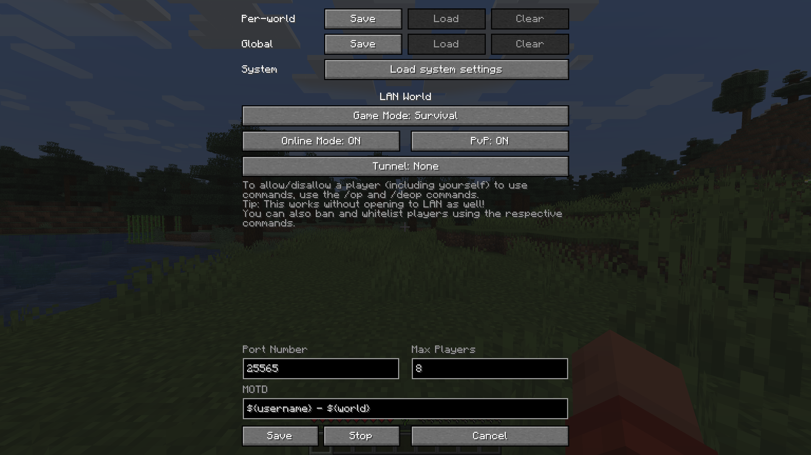

# Custom LAN

A **Fabric** mod that allows you to:
* Customize more of your integrated server (Online Mode, PvP, Port, Max Players, MOTD)
* Use ampersands (`&`) for [formatting codes](https://minecraft.wiki/w/Formatting_codes) instead of section signs (`§`) and variables (`${username}` and `${world}`) in the MOTD
* Change the settings mid-game (including the port) and stop the server without quitting the world
* Save the settings globally or per-world (they are loaded automatically with per-world settings taking priority over the global ones, which take priority over the system defaults)
* Change who can use cheats individually using the `/op` and `/deop` commands and cheat in singleplayer without opening to LAN (replaces the Allow Cheats button)
* Manage bans with `/ban`, `/ban-ip`, `/banlist`, `/pardon` and `/pardon-ip`, and whitelist players with `/whitelist` (use `/whitelist on`/`off` to enable/disable)

It also allows you to start the LAN world by pressing Enter, doesn't force the gamemode (e.g. anyone who left in Creative mode will still be in Creative when they join even if the world is set to Survival), and extends the `/publish` command, which can now change settings mid-game as well:
```
/publish [<port>] [<onlineMode>] [<pvpEnabled>] [<maxPlayers>] [<defaultGameMode>] [<motd>]
/publish [perworld|global|system] [<port>] [<onlineMode>] [<pvpEnabled>] [<maxPlayers>] [<defaultGameMode>] [<motd>]
/publish stop
```

It **only** requires [Fabric Loader](https://fabricmc.net/use/)—[Fabric API](https://modrinth.com/mod/fabric-api) is not required.

It has been backported to all Minecraft versions supported by Fabric (except the snapshots)!
I'm **not** planning on porting it to **Forge** myself *for now* ([this](https://forums.minecraftforge.net/topic/70592-113how-to-use-mixin-for-forge-modding/?tab=comments#comment-341587), [this](https://forums.minecraftforge.net/topic/97430-forgemixinfabric-question/), [that](https://web.archive.org/web/20210118022002/https://gist.github.com/jellysquid3/8b68b81a5e48462f8690284a0a3c89a1) and [that](https://gist.github.com/The-Fireplace/d092f25e892a46902ecdec68dee2b938) is why), but you're more than welcome to send me a pull request.

## Explanation of MOTD formatting codes and variables
In the MOTD, ampersands (`&`) are replaced with section signs (`§`) to allow you to enter [formatting codes](https://minecraft.wiki/w/Formatting_codes) (e.g. `&9Hello, &a&lworld!` makes `Hello,` blue and `world!` green and bold).
You can use two ampersands in a row (`&&`) to get an actual ampersand (`&`).

The following variables will be expanded using [Apache Commons Text's `StringSubstitutor`](https://commons.apache.org/proper/commons-text/apidocs/org/apache/commons/text/StringSubstitutor.html):
* `${username}` – the host's username (e.g. "DimiDimit")
* `${world}` – the world's name (e.g. "New World")

## Explanation of saved settings
The settings can be saved per-world or globally. When the Open to LAN screen is opened, the settings are loaded automatically in that order, and they can also be loaded manually using the Load buttons.

Using the `/publish` command without specifying which saved settings to use (`perworld`, `global` or `system`) uses the same order if the world hasn't been opened to LAN, or the current values instead of any saved settings if it has.
Specifying the saved settings uses those particular settings or the system defaults if they haven't been saved, without checking any others, even if the world has been opened to LAN (e.g. if `perworld` is specified and no per-world settings are saved, the system defaults will be used even if there are saved global settings).
The settings specified as arguments will override the saved settings or current values (e.g. `/publish perworld 12345 false` will use the per-world settings, except that the port will be `12345` and online mode will be disabled).

The global settings are stored in `.minecraft/config/customlan.json`, while the per-world ones are stored in `data/customlan.dat` in the respective world's directory.

## Explanation of `/op` and `/deop`
`/op` and `/deop` work like in dedicated servers.
You can also use them on yourself, the host. Doing this will add/remove the "Cheats" label on the world (as if you've NBT edited the `allowCommands` field), and you can use these commands without opening to LAN as well, replacing the Vanilla method of opening to LAN, cheating, quitting the world and entering it again.

Operators are persisted per-world in an `ops.json` file inside that world's directory. To allow operators to assign and remove other operators, as well as ban and whitelist players, change their `level` in the `ops.json` file to `3` or higher (the default is `2`, while level `4` allows them to use `/publish`). You, as the host, can always assign and remove operators, even if you're not an operator yourself.

## Explanation of bans and whitelists
These commands also work like in dedicated servers, though you cannot ban or whitelist the host.
Enabling the whitelist does **not** kick all non-whitelisted players (i.e. `enforce-whitelist` is always `false`).

The files used are also per-world and the same as on dedicated servers—`banned-players.json`, `banned-ips.json`, `whitelist.json`—though whether the whitelist is enabled is stored in `data/customlan.dat`.
